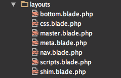
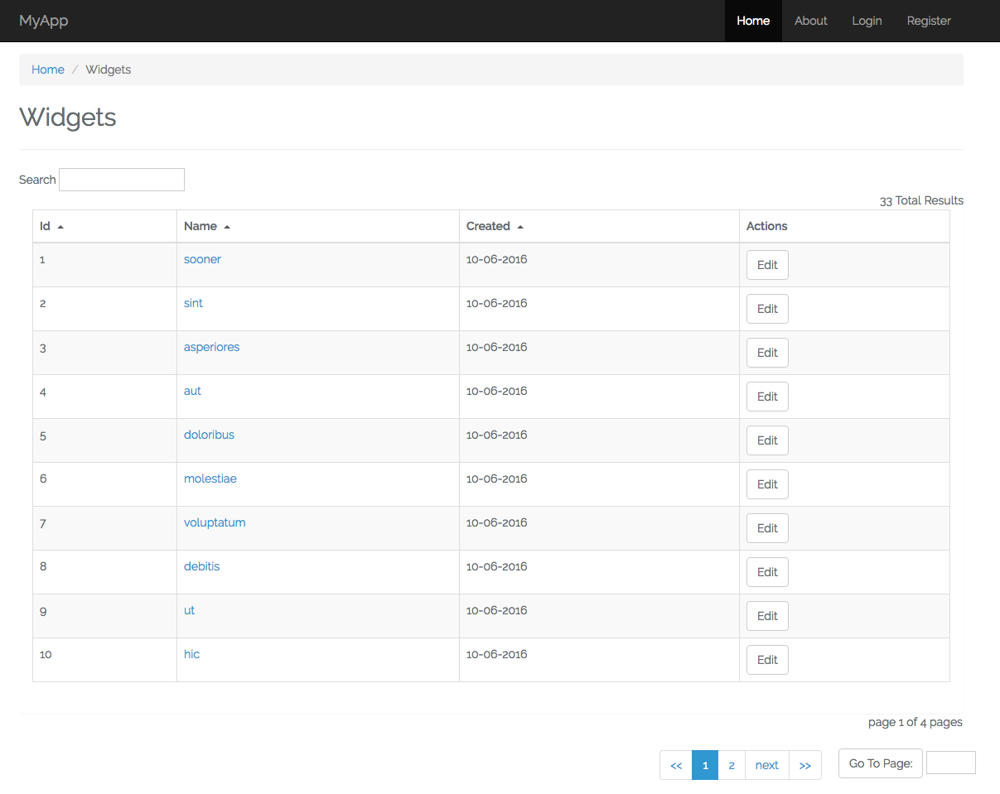
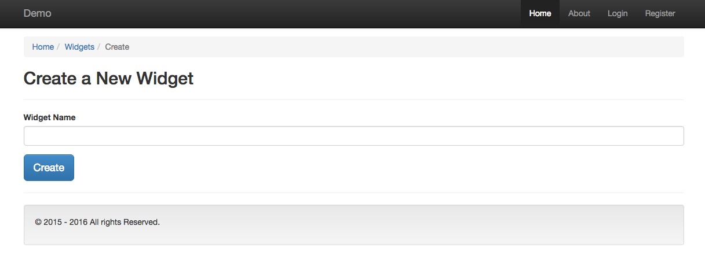

**#** # FoundationMaker For Laravel 5.3

[![Latest Version on Packagist][ico-version]][link-packagist]
[![Software License][ico-license]](LICENSE.md)
[![Total Downloads][ico-downloads]][link-downloads]

**FoundationMaker** is a code generator for use with the Laravel PHP framework (5.3 and up) Artisan command line tool.

FoundationMaker adds 16 new artisan commands, providing ready-made templates for CRUD generation, Views and Datagrids, with ajax-powered search, column sorts and pagination.   You can create, migrate and test a foundation of code with crud and views in under a minute.  You can also make your own custom templates and tokens for use with FoundationMaker.

Help **[Support FoundationMaker](#support-FoundationMaker)**.  

**#** ## Install ##

Via Composer

```
composer require evercode1/foundation-maker

```

In your config/app.php file, add the following to the providers array:

```
Evercode1\FoundationMaker\FoundationMakerServiceProvider::class,

```

**#** ## Usage

**#** ## Summary

With the **[make:master](#makemaster)** command, instantly create a layouts folder and master page that uses Elixir to manage versioned assets.



With the **[make:assets](#makeassets)** command, instantly create the assets managed by Elixir that you need to run all datagrids.  


With the **[make:foundation](#makefoundation)** command, create a code foundation instantly and get a working datagrid, searchable, sortable, and paginated, written with vue.js:



You also get the create, edit, and show views, instantly.  Here is what the create view looks like:



Minimal bootstrap is used, so you can easily modify and extend as you wish.

With the **[make:templates](#maketemplates)** command, you can easily modify the templates that FoundationMaker uses, added your personalized touch to the code:


**#** ## FoundationMaker Commands

FoundationMaker will install 16 artisan commands.

8 make commands:

* **[make:assets](#makeassets)**
* **[make:child-of](#makechild-of)**
* **[make:crud](#makecrud)**
* **[make:foundation](#makefoundation)**
* **[make:master](#makemaster)**
* **[make:parent-child](#makeparent-child)**
* **[make:templates](#maketemplates)**
* **[make:views](#makeviews)**

8 remove commands:

* **[remove:assets](#removeassets)**
* **[remove:child-of](#removechild-of)**
* **[remove:crud](#removecrud)**
* **[remove:foundation](#removefoundation)**
* **[remove:master](#removemaster)**
* **[remove:parent-child](#removeparent-child)**
* **[remove:templates](#removetemplates)**
* **[remove:views](#removeviews)**

Use **[make:master](#makemaster)** to create a master page, providing dependencies, which includes:

* layouts folder
* master (you give it your name)
* meta partial
* css partial
* scripts partial
* bottom partial
* nav partial
* shim partial
* jquery
* bootstrap
* font-awesome

Use **[make:foundation](#makefoundation)** to create all files for crud and views, including:

* model
* controller
* api controller (if it does not yet exist)
* migration
* test
* Queries folder (if it does not yet exist)
* GridQueries folder (if it does not yet exist)
* GridQueries/Contracts folder (if it does not yet exist)
* GridQuery.php
* DataQuery.php
* appropriately named model query file
* Vue.js component
* appropriately-named view folder
* index view
* create view
* edit view
* show view

The **[make:foundation](#makefoundation)** command also appends to the following files:

* web.php
* ModelFactory.php
* ApiController (if it already exists)
* components.js

Use **[make:crud](#makecrud)** to create the files necessary to display a view:

* model
* controller
* api controller (if it does not yet exist)
* migration
* test
* Queries folder (if it does not yet exist)
* GridQueries folder (if it does not yet exist)
* GridQueries/Contracts folder (if it does not yet exist)
* GridQuery.php
* DataQuery.php
* appropriately named model query file

The **[make:crud](#makecrud)** command also appends to the following files:

* routes.php
* ModelFactory.php
* ApiController (if it already exists)

Use **[make:views](#makeviews)** to create views, including:

* appropriately-named view folder
* index
* create
* edit
* show
* appropriately-named Vue.js component

The **[make:views](#makeviews)** command also appends to the following files:

* components.js

The **[make:parent-child](#makeparent-child)** will create all crud and view files for both a parent and a child, including. 

* model
* controller
* api controller (if it does not yet exist)
* migration
* test
* Queries folder (if it does not yet exist)
* GridQueries folder (if it does not yet exist)
* GridQueries/Contracts folder (if it does not yet exist)
* GridQuery.php
* DataQuery.php
* appropriately named model query file
* Vue.js component
* appropriately-named view folder
* index view
* create view
* edit view
* show view

The  **[make:parent-child](#makeparent-child)** command also appends to the following files:

* web.php
* ModelFactory.php
* ApiController (if it already exists)
* components.js

This command operates the same way as the **[make:foundation](#makefoundation)** command, but it builds a foundation for both the parent and child.  

In the views, it will display the relationship and in the create and edit views of the child, you will get the related parent, so when you create a child record, you can associate it to a parent record.  Use the optional slug parameter if you want to have slugs on the show pages.

The **[make:child-of](#makechild-of)** command is similar to the **[make:parent-child](#makeparent-child)** command, but only creates the child.

The **[make:child-of](#makechild-of)** will create all crud and view files for both a parent and a child, including. 

* model
* controller
* api controller (if it does not yet exist)
* migration
* test
* Queries folder (if it does not yet exist)
* GridQueries folder (if it does not yet exist)
* GridQueries/Contracts folder (if it does not yet exist)
* GridQuery.php
* DataQuery.php
* appropriately named model query file
* Vue.js component
* appropriately-named view folder
* index view
* create view
* edit view
* show view

The  **[make:child-of](#makechild-of)** command also appends to the following files:

* web.php
* ModelFactory.php
* ApiController (if it already exists)
* components.js

It also modifies the parent model to include the relationship.  The slug option is available for this command as well.

**#** ## Master Page Required For All Views

Please note:

FoundationMaker templates assume you use and have a master page. If you don't already have a
master page, we recommend using our **[make:master](#makemaster)** command, it will instantly create it for you.

If you don't use our **[make:master](#makemaster)** to create your master page, then you need to make sure you have the following:

* a master page in a folder named layouts in your views folder
* the proper call to version assets using Elixir.

**#** ## How to Learn FoundationMaker Commands

To play around with FoundationMaker, and to learn quickly, we recommend installing a fresh build of Laravel with a working database connection.  Then run the **[make:master](#makemaster)**, which will provide your layouts folder and master page.

Next, run the **[make:assets](#makeassets)** command, which will set up the assets you need to manage in Elixir, which allow us to easily create and manage data grid components in Vue.js.

After you have your master page and assets, follow the **[make:foundation Workflow Example](#makefoundation-workflow-example)** in the next section.

**#** ## make:foundation Workflow Example

To fully understand the power of the **[make:foundation](#makefoundation)** command, let's walk through a typical use case.  For this, we will assume that you have a master page named master.blade.php in your layouts folder, which is in your views folder.

To create that we recommend using our **[make:master](#makemaster)** command, it will supply you with everything you need to create a foundation.  Just give your master page a name and supply an optional name for your app, like so:

```
php artisan make:master master Demo

```

That would create a layouts folder in your views directory and create a master page named master.blade.php.  

You can use your own master page, if you choose, but it’s best to work with the one supplied by FoundationMaker, when you are just learning.

Next, run the Next, run the **[make:assets](#makeassets)** command, which will set up the assets you need to manage in Elixir, which allow us to easily create and manage data grid components in Vue.js.

Then run gulp from the command line:

```

gulp

```
Please note that you only need to run the copy method once in your gulpfile.js file.  Once you have run gulp the first time and have copied your font assets, you can remove that line, so that your elixir method in gulpfile.js is as follows:

```

elixir(mix => {
   mix.sass(['app.scss', 'main.scss'], 'public/css/all.css')
      .webpack('app.js').version(['css/all.css', 'js/app.js']);

});


```

Now we're ready to try the **[make:foundation](#makefoundation)** command.  We’ll use an example model named Widget.  So let's create a Widget foundation for our Widget model with the following command:

```
php artisan make:foundation Widget master

```

Obviously, Widget is the name of the model we want to create. This is followed by master, which is the name of our master page.  We have the option to put on a third parameter, ‘Slug’, which will include slugs in the views, but we are not doing that for this example.

After the command runs, we're ready to migrate up to our db.  Before you migrate, this is where you can add additional columns for the DB, if you like.  To keep it simple, let's just migrate what we already have:

```
php artisan migrate
```

Next, we run gulp on the command line:

```

gulp

```

Everything should work at this point if you test the /widget route, but there is no data.  So let's run a unit test to add a single record by running from the command line:

```
vendor/bin/phpunit

```

You should get green and a record in the db. It's a very basic test and it should pass.


Next you can use the factory to seed the db.  We start by calling tinker:

```
php artisan tinker

```

Then the following command:

```
factory('App\Widget', 30)->create();

```

Then control D from the command line to quit tinker.

If you don't want to use tinker, manually add some records via the create form.

With that you should be able to go to your /widget route and see the following:


Please note that the header and footer pictured above are called in by the master page, so
if you did not use our **[make:master](#makemaster)** command, you will see the output of your master page instead or an error if you have no master page.

As you can see the workflow with the **[make:foundation](#makefoundation)** command is optimal, in under a minute you are able to stand up a working crud application.  You can then easily modify it to add the fields you want, and you have everything in place to support what you need, including all the basics like the model, migration, route and controller, as well as a unit test, api controller, and factory method for seeding.  The **[make:foundation](#makefoundation)** command provides you with a complete foundation to start from.

Also see the [tip for use with make:auth](#tip-for-use-with-makeauth) to see how you can use artisan's native make:auth command to set up all your auth views to extend the master page you have created with [make:master](#makemaster).

**#** ## make:assets

```
php artisan make:master master MyProject

```

This command modifies the following files:

* gulpfile.js
* bootstrap.js
* app.js
* app.scss

It also creates the following files:

* main.scss
* components.js

In your gulpfile.js, you will get a copy command on your elixir method for your font assets.  Once you run gulp once, you can remove that command, since you only need to copy the assets once.  After removing the copy method, it will look like this:

```

elixir(mix => {
   mix.sass(['app.scss', 'main.scss'], 'public/css/all.css')
      .webpack('app.js').version(['css/all.css', 'js/app.js']);

});


```

The make:assets command supplies you with everything you need to run the **[make:foundation](#makefoundation)** and the **[make:views](#makeviews)** commands.

**#** ## make:master


FoundationMaker's make:master command creates a layouts folder and places a master page and related files in it.

```
php artisan make:master {MasterName} {AppName=Demo}
```

The second parameter is optional and will default to Demo.

You supply the command with two arguments, the name you want for your master page and the name of your application.  For example, if we wanted our master page to be called master and our app name was MyProject:

```
php artisan make:master master MyProject

```

This will create the following:

* layouts folder within the views folder
* master page named by whatever you inputted
* bottom partial
* nav partial
* css partial
* meta partial
* scripts partial
* facebook partial

The master page includes the partials and this makes the code very easy to work with.

FoundationMaker includes a minimal bootstrap implementation, which you can easily change to suit your tastes.  


Using FoundationMaker's make:master also makes it easier to work with the other commands, such as **[make:foundation](#makefoundation)**, since it is setup for the dependencies that you need.

Note that the second argument in the make:master command is optional.  If you leave it off, for example:

```
php artisan make:master master

```

It will default to naming your app "Demo" in the bootstrap navbar-brand class, which will appear on your top nav.

**#** ## Tip for use with make:auth

Here's a tip for using make:master with artisan's native make:auth command.  As you probably already know, the make:auth command will create all your auth views, extending a master page named app.blade.php.  You can easily use both commands.  

Run [make:master](#makemaster) first, but make sure you do not name your master page 'app,' so there is no conflict with the page that the make:auth command will make.  After running [make:master](#makemaster), run the make:auth command.  Then all you have to do is go to the views/auth folder and change the @extends('layouts.app') directive in those view files to @extends('layouts.whatever-your-master-page-is-named').

Please note that the make:auth command also creates a controller that returns the user to a specific page for logging in and registering, so you will have to modify that view as well if you want your generated master page extended there as well.

**#** ## make:crud

```
php artisan make:crud Widget slug
```

The make:crud command takes two arguments, the name of the model you wish to build your crud on and the optional slug parameter.  As typed above, the command would create the following file types:

* model
* controller
* api controller (if it does not yet exist)
* migration
* test
* Queries folder (if it does not yet exist)
* GridQueries folder (if it does not yet exist)
* GridQueries/Contracts folder (if it does not yet exist)
* GridQuery.php
* DataQuery.php
* appropriately named model query file

It also appends to the following files:

* routes.php
* ModelFactory.php
* ApiController (if it already exists)

Since we specified ‘slug’, it will include the code necessary to have slugs on the show view.

You could then run the **[make:views](#makeviews)** command and have it functional, once you've migrated and seeded data or created a few records and run gulp.  

**#** ## make:views

The make views lets you quickly scaffold views for create, show, edit, and index, based on your input.

The make:views command has  the following arguments:

```
php artisan make:views {ModelName} {MasterPageName} {Slug=false} 

```
The last argument is optional and indicates whether or not you want slugs, and this should match the choice you made when you ran make:crud.

Before running make:views, at a minimum, you should already have your model, route and controller created.

As an alternative to doing that manually, you can use **FoundationMaker's** **[make:crud](#makecrud)** to do it for you.  Or you could use **[make:foundation](#makefoundation)** to create everything all at once.  If you use **[make:foundation](#makefoundation)**, you do not need to run make:views, since the views will be included in the foundation.

We recommend using our **[make:master](#makemaster)** command to make your master page.  In any event before you run make:views, you need to have your master page and assets ready.  If you have not created the assets, use the  **[make:assets](#makeassets)** command to create them and run gulp from the command line.

So for a make:views example, if you had a model named Widget, and you  had a master page
named master.blade.php, you may the following:

```
php artisan make:views Widget master

```

In the example above, we tell it the model name, 'Widget' and the master page name 'master.’  Since we didn’t want the slugs, we can simply leave that off the command, it will default to false.

Please remember to run gulp after both the **[make:vies](#makeviews)** and the **[make:assets](#makeassets)** commands.

If you wish to manipulate the templates being used by FoundationMaker, please run the **[make:templates](#maketemplates)** command.

**#** ## make:foundation

The make:foundation command has the following arguments:

```
php artisan make:foundation {ModelName} {MasterPageName} {Slug=false}

```

The last argument is optional and indicates the slug option to show slugs on the show view.  If you want to use that, include the string ‘slug’ as the 3rd argument.

Let's look at a typical example.  If you wanted to create a model named Widget without slugs, and you had a master page named master.blade.php, you may do the following:

```
php artisan make:foundation Widget master
 
```

You can also use the optional argument of ‘Slug.’  Adding slug will create slugs for your show view. 

make:foundation will create the following:

* model
* controller
* api controller (if it does not yet exist)
* migration
* test
* Queries folder (if it does not yet exist)
* GridQueries folder (if it does not yet exist)
* GridQueries/Contracts folder (if it does not yet exist)
* GridQuery.php
* DataQuery.php
* appropriately named model query file
* appropriately-named view folder
* index view
* create view
* edit view
* show view
* Vue.js component file

make:foundation also appends to the following files:

* routes.php
* ModelFactory.php
* ApiController (if it already exists)
* components.js

**#** ## make:templates

The signature of the command is as follows:

```
php artisan make:templates

```

**#** ## make:parent-child

Sometimes we need to associate two models, the most common example being Category and
Subcategory.  FoundationMaker's make:parent-child let's you create this relationship with a single
command.

The command has the following arguments:

```
php artisan make:parent-child {ParentName} {ChildName} {MasterPageName} {Slug=false}

```

So for example, you might want to run it as follows:

```
php artisan make:parent-child Category Subcategory master

```

That would be the equivalent to running the **[make:foundation](#makefoundation)** command on both Category and Subcategory, with a few important differences.

The datagrid it will build for Subcategory for example, will show the category that the subcategory belongs to.

Both the parent model and the child model will be built with the relationship made for you.  The parent will have a has many relationship and the child will have a belongsTo relationship in the model.

You also get a dropdown list of parent models, for example, categories, on the child create form, or in this case the subcategory create form, which allows you to associate the child to the parent.

This command, like the **[make:foundation](#makefoundation)** command, will create all the crud and views for you, you only need to run your migration, unit tests, and factory methods to populate them, and then run gulp to update the assets.  You can do this in under a minute.

**#** ## make:child-of

In cases where you have an existing model, and you want to create a foundation for a child model, you should use the make:child-of command.  The signature of the command is as follows:

```
php artisan make:child-of {ParentName} {ChildName} {MasterPageName} {Slug=false}

```

So for example, if you had created a foundation for AutoMaker and you wanted a child model named AutoPart, you could run the following command:

```
php artisan make:child-of AutoMaker AutoPart master
 
```

This would update the parent model, in this case AutoMaker, with the has many relationship and also create a foundation for AutoPart, which will include the belongs to relationship to AutoMaker.

**#** ## make:templates

```
php artisan make:templates
 
```

This command will make a Templates folder in your app folder.  You may customize these templates as you wish and FoundationMaker will use these templates instead of the default templates.

You may also inject custom tokens into these templates by using the CustomTokens class in the CustomTokens.php file in your Templates folder.  Read the comments in the file for usage.  You can read more on this:

 **[Custom Tokens](#customtokens)**

**#** ## Remove Commands

**#** ## remove:master

```
php artisan remove:master

```

This command will remove your layouts folder and everything in it.

**#** ## remove:foundation

```
php artisan remove:foundation {ModelName}

```

This command will remove all of the foundation files for the given model:

remove:foundation will remove the following:

* model
* controller
* api controller (if empty)
* migration
* test
* appropriately named model query file
* factory method
* routes


**#** ## remove:crud

This command will remove all of the crud files for the given model:

```
php artisan remove:crud {ModelName}

```

remove:crud will remove the following:

* model
* controller
* api controller (if empty)
* migration
* test
* appropriately named model query file
* factory method
* routes

**#** ## remove:views

This command will remove all of the view files for the given model:

```
php artisan remove:views {ModelName}

```

Remove:views  will remove the following:

* appropriately-named view folder
* index view
* create view
* edit view
* show view
* Vue.js component
* component call from components.js

**#** ## remove:child-of

This command will remove all of the foundation files for the given parent and child:

```
php artisan remove:child-of {ParentName} {ChildName}

```

remove:child-of will remove the following:

* child model
* child controller
* child api controller methods
* child migration
* child test
* child model query file
* child view folder
* child index view
* child create view
* child edit view
* child show view
* child Vue.js component
* child component call in components.js
* child factory method
* child routes
* parent model relationship

**#** ## remove:templates

If you have used the **[make:templates](#maketemplates)** command to create the Templates folder in your app folder, you can use the **[remove:templates](#removetemplates)** command to remove the entire folder. 


**#** ## Requirements For Views

To use the **[make:views](#makeviews)** or **[make:foundation](#makefoundation)** command successfully, you need to have a master page. We recommend using our **[make:master](#makemaster)** command, it will give you a nice starting point for your project.

You also need to have certain assets in place, which you can get by running the **[make:assets](#makeassets)** command and running gulp.

**#** ## Tokens

Here is a list of tokens you may use in the custom templates:

* apiControllerMethod
* apiDataPath
* appName
* chartApiRoute
* chartApiControllerMethod
* child
* childMigrationModel
* childRelation
* childsTableName
* createdAt
* controllerName
* endGridName
* field_name
* folderName
* gridApiRoute
* gridComponentName
* gridName
* masterPageName
* migrationModel
* model
* modelAttribute
* modelId
* modelInstance
* modelPath
* modelResults
* modelRoute
* modelsUpperCase
* parent
* parentFieldName
* parentId
* parent_id
* parentInstance
* parentInstances
* parentModelPath
* parentsTableName
* slug
* tableName
* upperCaseModelName
* useModel
* useParent
* vueApiControllerMethod

If you wish to embed a token in a template, which you can do after running the make:templates command, use the following convention.  For example, if you wish to display the model name:


```
:::model:::

```

The convention is 3 colons before and after the token.

If you wish to use custom tokens that you make yourself, please see the next section.

**#** ## Custom Tokens

In addition to the tokens FoundationMaker ships with out of the box, you can define your own tokens, after you run the **[make:templates](#maketemplates)** command.

After running that command, you will find in your app/Templates folder a file named CustomTokens.php.  Use that file to define your tokens.

### Models

When inputting model names, you have some options.  Ultimately FoundationMaker will convert it to the proper format as long as it close.

The best way to input the model name is to stick with Laravel’s conventions.  Here are a couple of examples:

~~~~

php artisan make:views Widget master

~~~~

For compound words:

~~~~

php artisan make:views BigWidget master

~~~~

To make things easier, and to not have to delete a lot of files over a typo, I built in some flexibility into how you can supply the model name to the commands.

For models with a single word, you can also use the lowercase version of the word as the first argument of the command:

~~~~

php artisan make:foundation widget master

~~~~


In this case, widget represents the Widget model. FoundationMaker will convert it automatically to uppercase for use in the appropriate places in the templates.

If you have model with compound words, for example, AlphaWidget, then you can type it as the lowercase, separated by a dash:

~~~~

php artisan make:foundation alpha-widget master dt

~~~~


Note, whether you use AlphaWidget or alpha-widget, your route would be:

~~~~

Route::resource('alpha-widget', 'AlphaWidgetController');

~~~~

FoundationMaker will convert plural in model names to singular, which is a handy protector against making mistakes.

### Routes

Routes for models with a single word take on the lowercase value of the model. For example, for the Widget model, you would have the following route:

~~~~

Route::resource('widget', 'WidgetController');

~~~~


Routes for models made up of compound words, will have a dash separating them. For example, for the AlphaWidget model, you would have the following route:

~~~~

Route::resource('alpha-widget', 'AlphaWidgetController');

~~~~


**#** ## Support FoundationMaker

I hope you enjoy this plugin and find it useful.  I don’t have a donate button, but If you would like
to support my work and learn more about Laravel, you can do so by buying one of
my books, **[Laravel 5.3 For Beginners](https://leanpub.com/laravel-5-3-for-beginners)**,
I really appreciate it.

**#** ## Change log

Please see [CHANGELOG](CHANGELOG.md) for more information what has changed recently.

**#** ## Contributing

Please see [CONTRIBUTING](CONTRIBUTING.md) and [CONDUCT](CONDUCT.md) for details.

**#** ## Security

If you discover any security related issues, please email ikon321@yahoo.com instead of using the issue tracker.

**#** ## Credits

- [Bill Keck](https://github.com/evercode1)

**#** ## License

The MIT License (MIT). Please see [License File](LICENSE.md) for more information.

[ico-version]: https://img.shields.io/packagist/v/evercode1/foundation-maker.svg?style=flat-square
[ico-license]: https://img.shields.io/badge/license-MIT-brightgreen.svg?style=flat-square
[ico-travis]: https://img.shields.io/travis/evercode1/foundation-maker/master.svg?style=flat-square
[ico-scrutinizer]: https://img.shields.io/scrutinizer/coverage/g/evercode1/foundation-maker.svg?style=flat-square
[ico-code-quality]: https://img.shields.io/scrutinizer/g/evercode1/foundation-maker.svg?style=flat-square
[ico-downloads]: https://img.shields.io/packagist/dt/evercode1/foundation-maker.svg?style=flat-square

[link-packagist]: https://packagist.org/packages/evercode1/foundation-maker
[link-downloads]: https://packagist.org/packages/evercode1/foundation-maker/stats
[link-author]: https://github.com/evercode1


